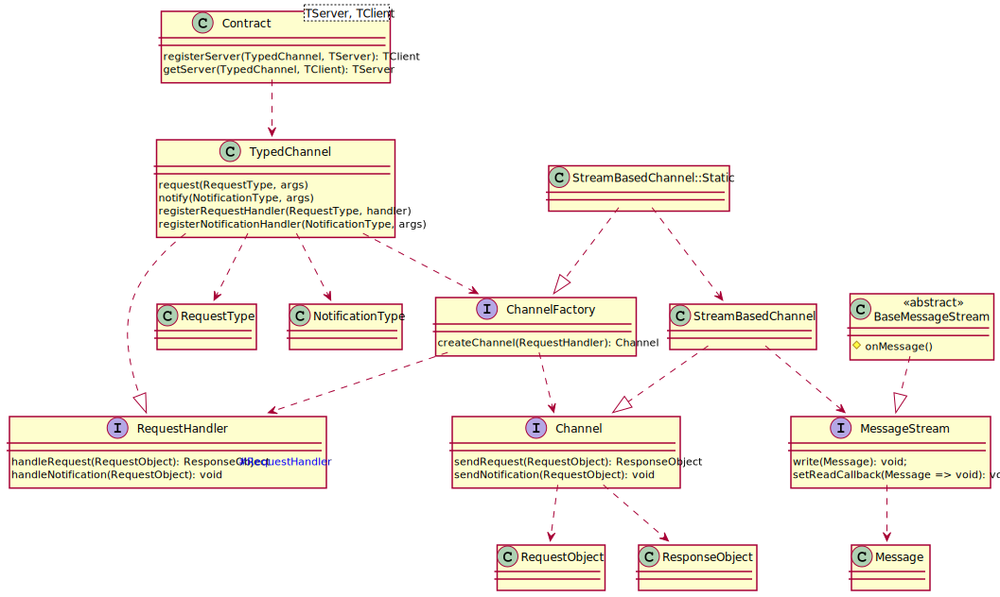

# Typed RPC Library based on JSON RPC

[](https://twitter.com/intent/follow?screen_name=hediet_dev)

A strongly typed remote procedure call library for typescript.

Is compatible with JSON RPC 2.0. However, only object arguments are supported at the moment.

# Install

To install the base library:

```
yarn add @hediet/json-rpc
```

For websocket clients:

```
yarn add @hediet/json-rpc-websocket
```

For websocket servers:

```
yarn add @hediet/json-rpc-websocket-server
```

For webworker communication:

```
yarn add @hediet/json-rpc-browser
```

For process stdio communication:

```
yarn add @hediet/json-rpc-streams
```

# Features

-   Runtime checked types through `io-ts`
-   Supports Request/Response and Notification semantics
-   Supports Error and Success Responses
-   Provides a lot of abstractions (see Architecture)
-   Provides RPC over various mediums
    -   Websockets
    -   NodeJS Streams (Stdio)
    -   Webworker

# Usage

## Defining Contracts

It is recommended to use the contracts API to specify RPC interfaces.
Servers and clients are handled symmetrically.

```ts
import {
	semanticJson as s,
	contract,
	requestType,
	notificationType,
} from "@hediet/json-rpc";

const myRpcContract = contract({
	// the interface for clients to interact with servers
	server: {
		calculate: requestType({
			// io-ts is used to specify types.
			// This might change in future major versions.
			params: s.sObject({
				data: s.sString(),
			}),
			result: s.sString(),
		}),
	},
	// the interface for servers to interact with clients
	client: {
		progress: notificationType({
			params: s.sObject({
				progress: s.sNumber(),
			}),
		}),
	},
});
```

## RPC over Websockets

Server:

```ts
import { Contract, ConsoleRpcLogger } from "@hediet/json-rpc";
import { startWebSocketServer } from "@hediet/json-rpc-websocket-server";

const clients = new Set<typeof myRpcContract.TClientInterface>();
startWebSocketServer({ port: 12345 }, async (stream) => {
	// `stream` provides methods to send and receive messages
	const { client } = Contract.registerServerToStream(
		myRpcContract,
		stream,
		// You can specify a logger to make debugging easier.
		new ConsoleRpcLogger(),
		{
			calculate: async ({ data }) => {
				// call the client
				await client.progress({ progress: 0.5 });
				return data;
			},
		}
	);
	clients.add(client);
	await stream.onClosed;
	clients.delete(client);
});
```

Client:

```ts
import { Contract, ConsoleRpcLogger } from "@hediet/json-rpc";
import { WebSocketStream } from "@hediet/json-rpc-websocket";

const { server } = Contract.getServerFromStream(
	myRpcContract,
	await WebSocketStream.connectTo({ address: "ws://localhost:12345" }),
	new ConsoleRpcLogger(),
	{
		progress: ({ progress }) => console.log("progress", progress),
	}
);
const result = await server.calculate({ data: "some data" });
```

## RPC over Standard Input/Output

Main process:

```ts
import { Contract } from "@hediet/json-rpc";
import { NodeJsMessageStream } from "@hediet/json-rpc-streams";

const proc = spawn("node", [join(__dirname, "echo-process")]);
const { server } = Contract.getServerFromStream(
	myRpcContract,
	NodeJsMessageStream.connectToProcess(proc),
	logger,
	{
		progress: ({ progress }) => console.log("progress", progress),
	}
);
const result = await server.calculate({ data: "some data" });
```

Child process:

```ts
import { Contract } from "@hediet/json-rpc";
import { NodeJsMessageStream } from "@hediet/json-rpc-streams";

const { server } = Contract.getServerFromStream(
	myRpcContract,
	NodeJsMessageStream.connectToThisProcess(),
	logger,
	{
		calculate: async ({ data }) => {
			await client.progress({ progress: 0.5 });
			return data;
		},
	}
);
```

## RPC over Web-Workers

Main window:

```ts
import { Contract } from "@hediet/json-rpc";
import { connectToWorker } from "@hediet/json-rpc-browser";

const worker = new Worker("./browser-worker.ts");
const { server } = Contract.getServerFromStream(
	myRpcContract,
	connectToWorker(worker),
	logger,
	{
		progress: ({ progress }) => console.log("progress", progress),
	}
);
const result = await server.calculate({ data: "some data" });
```

Web-Worker:

```ts
import { Contract } from "@hediet/json-rpc";
import { workerConnectToParent } from "@hediet/json-rpc-browser";

const { server } = Contract.getServerFromStream(
	myRpcContract,
	workerConnectToParent(),
	logger,
	{
		calculate: async ({ data }) => {
			await client.progress({ progress: 0.5 });
			return data;
		},
	}
);
```

# Architecture of `@hediet/json-rpc`



Extend `BaseMessageStream` if you want to implement custom message transport.

Implement `Channel` or `ChannelFactory` if you already provide a request/response channel.
